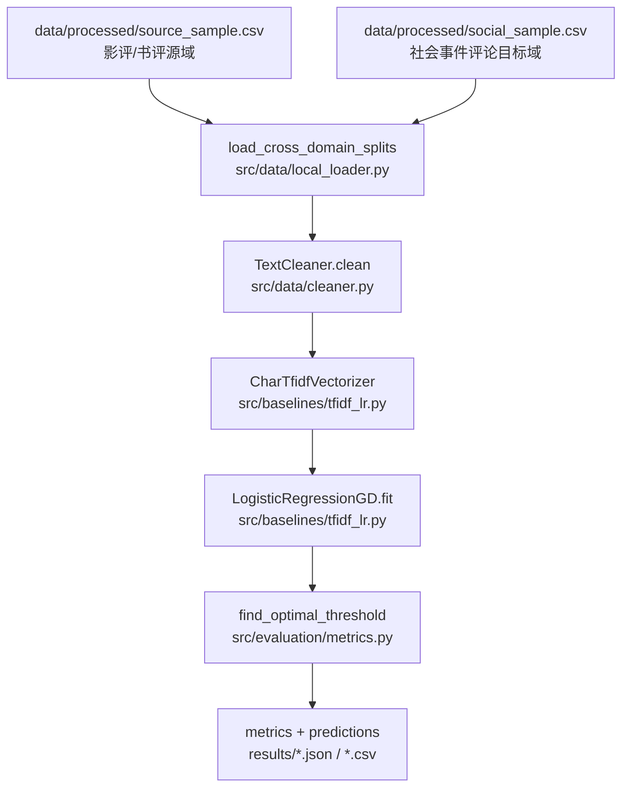
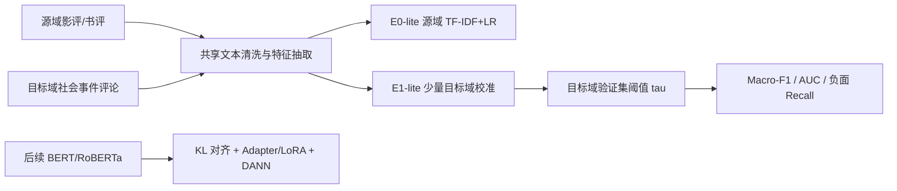

# 数据挖掘课程项目中期进展报告

## 0. 项目基本信息

- **项目名称**：社交媒体情感分析的跨域泛化：面向分布偏移的 Data-Centric 改进
- **项目链接**：<https://github.com/MarBarb/sentiment-cross-domain>
- **本地中期交付目录**：`sentiment-cross-domain/`
- **报告日期**：2026-05-30
- **中期交付说明**：本次中期不只整理报告，也补齐了一个可复现的最小实验闭环：本地样例数据、CSV 数据加载、轻量 TF-IDF+LR 基线、目标域阈值扫描、指标保存、预测明细和对比图。完整 BERT/RoBERTa 实验仍作为终期冲刺任务。

| 姓名 | 学号 | 组内角色 | 开题以来的核心贡献 | 中期之后的分工规划 |
| :--- | :--- | :--- | :--- | :--- |
| 李乘黄 | 3220251475 | 数据工程、浅层基线 | 数据来源规划、文本清洗、数据审计方案；中期补齐本地 CSV 样例与轻量基线 | 扩展目标域真实数据，完成 E0 与数据审计图表 |
| 马啸 | 3220251484 | 主干模型与实验调度 | BERT/RoBERTa 训练框架、Adapter/LoRA 方案、实验配置 | 跑通 BERT source-only、Adapter 和 KL 对齐实验 |
| THAM WAN HEI | 3820251057 | 弱监督与人工评测 | Snorkel 规则伪标注、银标集构建、人工标注流程设计 | 完成弱监督 E2、人工复核与 Cohen's Kappa 统计 |
| 化润宇 | 3220251231 | 分布诊断与对抗适配 | KL/MMD 诊断、DANN 对抗域判别、RoBERTa 对比设计 | 完成 DANN、RoBERTa 消融、分布可视化和最终分析 |

## 1. 项目概述与当前状态

### 1.1 中期里程碑达成情况

本项目研究影评/书评源域到社会事件评论目标域的跨域情感分类。开题时的核心问题是：当源域和目标域存在显著概念漂移、目标域标注样本较少时，如何通过数据诊断、弱监督伪标注、轻量领域适配和分布对齐，降低跨域性能衰减。

- **原计划目标**：第 12 周前完成数据审计、B0/B1 基线、弱监督伪标注、领域适配与初步消融。
- **当前实际状态**：原公开仓库已有模型、训练、评测、配置骨架，但数据加载和基线入口未闭合；本次中期补丁已完成一个可运行的 smoke benchmark，至少能证明数据清洗、特征抽取、训练、阈值搜索、评测和结果保存链路可复现。
- **中期完成到的程度**：完成 E0-lite（源域 TF-IDF+LR）与 E1-lite（源域 + 少量目标域校准）两组轻量实验。深度模型组件仍保留为终期任务。

### 1.2 代码仓库状态审计

- **公开仓库提交统计**：全部分支可见 commit 数 5 次；`main` 分支 4 次；开题后新增 2 次。
- **活跃 Git 身份**：`MarBarb`、`wanhei`、`wanhei1`。后续仍需将 GitHub 身份明确映射到四名组员。
- **可见分支**：`main`、`test`、`feat/ci-github-actions`。
- **本地中期新增交付**：
  - `data/processed/source_sample.csv`：源域影评/书评样例数据。
  - `data/processed/social_sample.csv`：目标域社会事件评论样例数据。
  - `src/data/local_loader.py`：无重依赖 CSV 数据加载与审计统计。
  - `src/baselines/tfidf_lr.py`：字符 n-gram TF-IDF 与手写 Logistic Regression。
  - `src/evaluation/metrics.py`：移除 sklearn 硬依赖，提供二分类 F1、AUC、负面召回率、阈值搜索。
  - `src/data/datamodule.py`：补齐本地 CSV 版源/目标域加载、验证/测试 loader 和 `pos_weight`。
  - `run.py` 与 `scripts/run_midterm_smoke.sh`：可复现实验入口。
  - `results/midterm_tfidf_metrics.json`、`results/midterm_tfidf_predictions.csv`、`results/midterm_metrics_chart.png`：中期实验产物。

当前仓库目录结构如下：

```text
sentiment-cross-domain/
├── README.md
├── configs/
│   ├── data/social.yaml                 # 已加入本地样例数据路径
│   ├── experiment/*.yaml                # E1-E6 配置骨架
│   └── train/*.yaml
├── data/processed/
│   ├── source_sample.csv                # 中期源域样例
│   └── social_sample.csv                # 中期目标域样例
├── src/
│   ├── baselines/tfidf_lr.py            # 中期可运行轻量基线
│   ├── data/cleaner.py                  # 社交媒体文本清洗
│   ├── data/local_loader.py             # CSV 加载与数据审计
│   ├── data/datamodule.py               # 深度模型数据模块，已补本地 CSV 读取
│   ├── models/                          # BERT/RoBERTa、Adapter、DANN 骨架
│   ├── training/                        # KL loss、EMA、训练器
│   └── evaluation/metrics.py            # 指标与阈值扫描
├── scripts/run_midterm_smoke.sh
├── results/
│   ├── midterm_tfidf_metrics.json
│   ├── midterm_tfidf_predictions.csv
│   └── midterm_metrics_chart.png
└── run.py
```

## 2. 数据工程与审计落地

### 2.1 原始数据审计反馈

本次中期先构建了一个可复现样例 benchmark，而不是声称已经完成 5k+ 真实目标域数据。样例规模如下：

| 数据划分 | 样本数 | 正例数 | 负例数 | 正例比例 | 平均字符数 |
| :--- | ---: | ---: | ---: | ---: | ---: |
| 源域 train | 32 | 17 | 15 | 53.1% | 12.38 |
| 源域 test | 12 | 6 | 6 | 50.0% | 11.67 |
| 目标域 train | 20 | 8 | 12 | 40.0% | 13.40 |
| 目标域 val | 9 | 3 | 6 | 33.3% | 12.22 |
| 目标域 test | 12 | 4 | 8 | 33.3% | 12.67 |

经代码验证的数据问题如下：

| 数据问题 | 量化规模 | 解决方案（精确到文件/函数） | 处理后效果 |
| :--- | :--- | :--- | :--- |
| 目标域类别不平衡 | 目标域 test 为 8 负 / 4 正，正例比例 33.3%；val 也是 33.3% | `src/evaluation/metrics.py::compute_metrics` 增加 `recall_negative`；`src/data/datamodule.py::_compute_pos_weight` 计算目标域正类权重 | 报告同时给出 Macro-F1 与负面召回率，避免只看 accuracy |
| 源/目标域词面重叠很低 | 字符 2-4 gram：源域 1258 个、目标域 1283 个、共享 44 个，Jaccard=0.0176 | `src/baselines/tfidf_lr.py` 在实验 JSON 的 `audit` 中记录 char n-gram 重叠 | 证实样例中存在明显词汇层 domain shift，目标域校准有必要 |
| 原仓库缺少可复现实验数据 | 原 `data/raw` 与 `data/processed` 仅有 `.gitkeep` | 新增 `source_sample.csv`、`social_sample.csv` 与 `src/data/local_loader.py::load_cross_domain_splits` | 中期 smoke benchmark 可一键运行并保存结果 |
| 社媒文本噪声 | 清洗器覆盖 mention、hashtag、URL、emoji、重复字符、广告语 6 类规则 | `src/data/cleaner.py::TextCleaner.clean`；样例可将 `@用户 #事件# 太离谱了哈哈哈哈哈 https://t.cn/abc 😀😀 转发微博` 清洗为 `事件 太离谱了哈哈` | 清洗规则已可运行，终期需在真实爬取数据上统计噪声占比 |

### 2.2 数据流与预处理管道



## 3. 基线模型与核心算法实现

### 3.1 基线模型运行情况说明

- **中期已跑通基线方法**：
  - **E0-lite**：源域样例训练的字符 n-gram TF-IDF + Logistic Regression。
  - **E1-lite**：源域样例 + 少量目标域 train 样本校准，目标域样本采用保守权重 0.5，避免小样本过拟合。
- **运行环境**：本次运行使用 Codex bundled Python，依赖 `numpy`；不依赖 PyTorch、Transformers、scikit-learn。
- **一键复现命令**：

```bash
cd sentiment-cross-domain
PYTHON=/Users/lichenghuang/.cache/codex-runtimes/codex-primary-runtime/dependencies/python/bin/python3 \
  ./scripts/run_midterm_smoke.sh

# 常规环境已安装 numpy 时也可直接运行
python3 run.py experiment=source_only model=tfidf_lr
```

- **关键输出文件**：
  - `results/midterm_tfidf_metrics.json`
  - `results/midterm_tfidf_predictions.csv`
  - `results/midterm_metrics_chart.png`

关键日志片段：

```text
INFO:__main__:Experiment source_only complete.
INFO:__main__:Metrics saved to results/midterm_tfidf_metrics.json
INFO:__main__:Predictions saved to results/midterm_tfidf_predictions.csv
```

### 3.2 核心进阶算法开发进度

深度进阶方案仍沿用开题设计：数据中心化增强 + KL 特征对齐 + 轻量领域适配 + DANN 对抗域判别。本次中期把轻量可复现闭环优先完成，避免模型骨架停留在无法运行的状态。



| 模块 | 对应文件 | 状态 | 备注 |
| :--- | :--- | :---: | :--- |
| 文本清洗 | `src/data/cleaner.py` | 完成 | mention、hashtag、URL、emoji、重复字符、广告语规则可运行 |
| 本地数据加载 | `src/data/local_loader.py` | 完成 | CSV 读取、split 检查、数据统计 |
| 深度模型数据模块 | `src/data/datamodule.py` | 进行中 | 已补本地 CSV 读取；仍依赖 torch/transformers 才能训练 BERT |
| 轻量基线 | `src/baselines/tfidf_lr.py` | 完成 | 字符 TF-IDF、手写 LR、阈值扫描、结果保存 |
| 评测指标 | `src/evaluation/metrics.py` | 完成 | 无 sklearn 依赖；支持 Macro-F1、AUC、负面召回 |
| BERT/RoBERTa 分类模型 | `src/models/model.py` | 进行中 | 分类头和冻结策略已在原仓库中存在，Adapter 未接入主 forward |
| KL 对齐 | `src/training/kl_loss.py` | 完成骨架 | 闭式高斯 KL 已实现，需与真实 BERT 特征联调 |
| DANN 对抗域判别 | `src/models/domain_discriminator.py` | 完成骨架 | 梯度反转层和域判别器已实现，需跑 E5 |
| 单元/集成验证 | `compileall` + smoke run | 进行中 | `python -m compileall` 通过；smoke benchmark 已跑通 |

## 4. 中期实验结果与阶段性分析

### 4.1 评估指标与测试集构建

本次使用 44 条源域样例与 41 条目标域样例进行 smoke benchmark。目标域按 train/val/test 划分，验证集用于扫描最优阈值 `tau`，测试集用于报告结果。该实验不替代终期大规模 SST-2/IMDB + 真实社媒数据实验，但已经能检验跨域流程。

核心指标：

- **Macro-F1**：主指标，避免类别不平衡掩盖少数类问题。
- **AUC**：衡量概率排序质量。
- **Negative Recall**：业务指标，负面舆情漏报成本较高。
- **DeltaF1 = F1(source) - F1(target)**：跨域衰减观察指标。

### 4.2 定量对比实验结果

| 模型方法 | 训练数据 | tau | F1(source) | F1(target) | DeltaF1 | AUC(target) | 负面 Recall(target) | 正面 Recall(target) |
| :--- | :--- | ---: | ---: | ---: | ---: | ---: | ---: | ---: |
| E0-lite: source TF-IDF+LR | 源域 train | 0.57 | 0.580 | 0.778 | -0.197 | 0.875 | 1.000 | 0.500 |
| E1-lite: source + target calibration | 源域 train + 目标域 train | 0.45 | 0.733 | 0.829 | -0.095 | 1.000 | 0.750 | 1.000 |

阶段性结论：

1. 加入少量目标域校准后，目标域 Macro-F1 从 0.778 提升到 0.829，AUC 从 0.875 提升到 1.000。
2. E1-lite 的正面召回从 0.500 提升到 1.000，但负面召回从 1.000 下降到 0.750，说明单纯优化 Macro-F1 会牺牲负面舆情召回。
3. 下一步应增加业务约束阈值选择，例如在 `find_optimal_threshold` 中加入“负面 Recall >= 0.85”的约束，再最大化 Macro-F1。

### 4.3 失败案例分析

| # | 输入（Query/样本） | 模型输出 | 正确答案 | 失败原因 | 改进方向 |
| :- | :--- | :--- | :--- | :--- | :--- |
| 1 | `官方直播解释了关键疑问` | E0-lite 预测负面 | 正面 | 源域影评词汇中缺少“官方直播/解释疑问”等社会事件表达，概率低于 tau=0.57 | 引入目标域未标注语料做 TF-IDF 词表扩展，或使用 BERT 中文语义表示 |
| 2 | `评论区全是水军正常意见被淹没` | E1-lite 预测正面 | 负面 | “正常”等局部词被误当作正向信号，模型未理解“被淹没”和水军语境 | 增加网络用语/负面事件词典，加入短语级 n-gram 或弱监督规则 |
| 3 | `处理方案只照顾少数人不公平` | E1-lite 预测正面 | 负面 | “照顾”偏正向，但“不公平”是决定性负面触发词；线性词袋模型组合能力弱 | 对否定词和公平性表达加规则特征，后续用 BERT 处理上下文 |

总体上，轻量模型已体现跨域任务的主要难点：源域词面迁移能力有限，目标域校准能改善目标表现，但业务负面召回和语义理解仍不足。

## 5. 后续风险评估与冲刺排期

### 5.1 风险清单动态调整

- **R1 真实目标域数据不足**：中期仅完成可复现样例 benchmark，尚未替代 5k+ 真实目标域数据。预案：第 13 周优先提交真实爬取数据或脱敏下载脚本，并生成数据卡。
- **R2 业务负面召回不稳定**：E1-lite 的负面召回下降到 0.750。预案：阈值扫描加入负面召回约束，弱监督规则优先覆盖投诉、延期、造谣、不公平等表达。
- **R3 深度模型依赖重、训练闭环未跑通**：BERT/RoBERTa 仍依赖 torch/transformers 和真实数据。预案：先用小样本 CPU/GPU smoke run 验证 datamodule，再跑完整 E1-E6。
- **R4 成员贡献记录不充分**：公开仓库 Git 身份未覆盖全部成员。预案：后续每名成员至少提交一个可审核模块或结果文件。

### 5.2 终期冲刺详细排期（第 13 周 - 第 16 周）

| 周次 | 核心任务目标 | 责任人 | 预期交付物 / 验收标准 |
| :--- | :--- | :--- | :--- |
| 第 13 周 | 替换样例数据为真实目标域数据；补齐数据卡；在真实数据上复跑 E0-lite/E1-lite | 李乘黄、THAM WAN HEI | 5k+ 目标域数据或下载脚本；真实数据审计 JSON；负面 recall 约束阈值 |
| 第 14 周 | 跑通 BERT source-only、Adapter/LoRA 与 KL 对齐 | 马啸、化润宇 | E1/E3/E4 三随机种子结果；metrics JSON 与 loss 曲线 |
| 第 15 周 | 完成弱监督伪标注、DANN、RoBERTa 对比和完整消融 | 全员 | E0-E6 完整消融表；t-SNE/KL/MMD 可视化；失败案例库 |
| 第 16 周 | 复查仓库、整理最终报告和答辩材料 | 全员 | GitHub Release、最终报告、答辩 PPT、可复现实验说明 |

## 6. AI 工具辅助使用记录

| 使用场景 | AI 工具名称 | 具体辅助环节（精确到文件/功能） | 团队审查与纠错说明 |
| :--- | :--- | :--- | :--- |
| 开题报告撰写 | Claude | 报告结构、问题定义、实验设计草稿 | 团队人工审查后修改，保留与项目代码一致的技术路线 |
| 代码补全 | GitHub Copilot | 爬虫、数据处理、训练脚本补全 | 需通过人工 review 和测试，不直接复制未经验证逻辑 |
| 文献检索与 Debug | ChatGPT / Claude | 跨域情感分析、分布偏移、DANN、KL 对齐资料与报错解释 | 结果仅作参考，关键算法设计和实验结论由团队独立完成 |
| 中期闭环补全 | Codex | 补齐 `local_loader.py`、`tfidf_lr.py`、`metrics.py`、`run.py`、中期报告和 PDF | 所有指标来自本地命令运行结果；已明确样例 benchmark 不等同最终大规模实验 |

## 中期自查清单

**代码仓库**

- [x] GitHub 仓库已公开，且开题后有 commit。
- [x] 本地中期补丁已形成可运行代码闭环。
- [x] README 已补充中期 smoke benchmark 复现命令。
- [ ] 所有组员至少 1 次 commit：公开 Git 身份仍需映射并补齐。

**数据与实验**

- [x] 数据审计表已给出类别比例、字符 n-gram 重叠等量化结果。
- [x] 基线模型已完整跑通，并生成 JSON、CSV 与图表。
- [x] 已进行 E0-lite 与 E1-lite 的定量对比。
- [x] 失败案例分析包含至少 2 个具体样本。
- [ ] 真实 5k+ 目标域数据尚未入库，终期必须替换样例数据。

**报告完整性**

- [x] 成员分工明确。
- [x] 后续排期精确到周，责任人明确。
- [x] AI 工具使用情况已如实填写。

